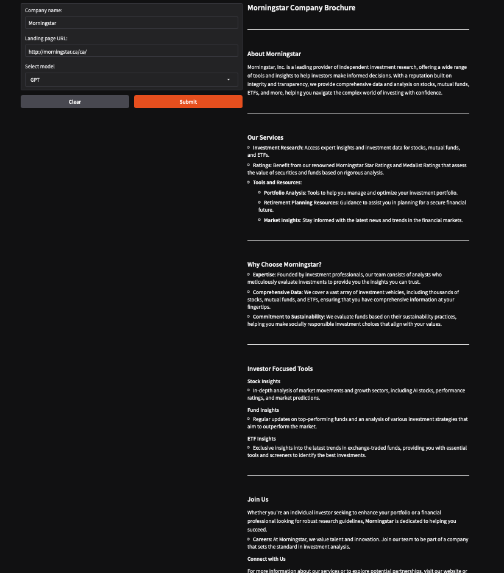

# OpenAI Web Brochure Maker

Sign up for OpenAI
https://platform.openai.com/docs/overview

This Python script scrapes a website, extracts useful links, and generates a short brochure about the company in Markdown format. The brochure includes details about the company, such as its culture, customers, and career opportunities, based on the content of relevant pages on the website.

## Table of Contents

- [openai-webpage-summarizer](#openai-webpage-summarizer)
  - [Table of Contents](#table-of-contents)
  - [Features](#features)
  - [Requirements](#requirements)
  - [Installation](#installation)
  - [Usage](#usage)
    - [Example](#example)

## Features

- Web Scraping: Extracts the main text and relevant links from a website.
- Automatic Link Classification: Identifies important links like About, Careers, and Company information.
- Brochure Generation: Uses OpenAI to summarize and format content into a Markdown brochure.
- Markdown Export: Automatically exports the generated brochure to a markdown file.

## Requirements

- Python 3.6+
- Packages:
  - requests
  - beautifulsoup4
  - python-dotenv
  - openai

## Installation

Set up your .env file in the project root and add your OpenAI API key:

`OPENAI_API_KEY=your-openai-api-key`

## Usage

1. Edit the WEB_URL variable in the script to point to the website you want to scrape.
2. Run the Python script: `python main.py`
3. The generated brochure will be saved as output.md in the project directory.

### Example

To create a brochure for Morningstar's website, set WEB_URL in the script to "https://www.morningstar.ca/ca/", then run the script. The generated markdown file will contain a summarized brochure of the company.

